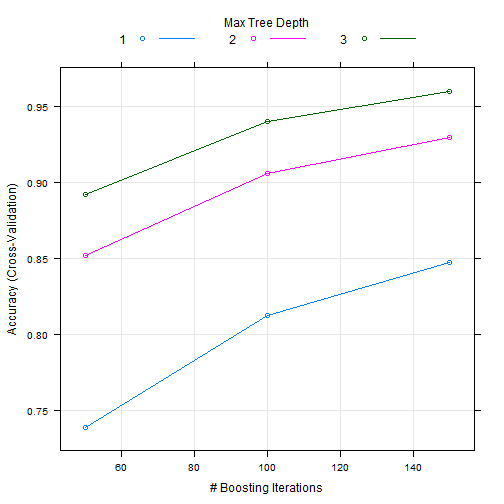

Practical Machine Learning Course Project
========================================================
## Introduction

Using devices such as Jawbone Up, Nike FuelBand, and Fitbit is now possible to collect a large amount of data about personal activity relatively inexpensively. These type of devices are part of the quantified self movement - a group of enthusiasts who take measurements about themselves regularly to improve their health, to find patterns in their behavior, or because they are tech geeks. One thing that people regularly do is quantify how much of a particular activity they do, but they rarely quantify how well they do it.

In this project, I am going to use the data from accelerometers on the belt, forearm, arm, and dumbell of 6 participant. They were asked to perform barbell lifts correctly and incorrectly in 5 different ways. The five ways are exactly according to the specification [A], throwing the elbows to the front [B], lifting the dumbbell only halfway [C], lowering the dumbbell only halfway [D] and throwing the hips to the front [E]. Please note that Class A corresponds to correct performance of the escercise. The goal of this project is to predict the manner in which the participants carry out the exercise. You can find more infromation about the study [here](http://groupware.les.inf.puc-rio.br/har)

## Getting and Cleaning Data

The training data for this project can be found here [download](https://d396qusza40orc.cloudfront.net/predmachlearn/pml-training.csv)
The test data are can be found here [download](https://d396qusza40orc.cloudfront.net/predmachlearn/pml-testing.csv)
The data for this project can be found at the [source](http://groupware.les.inf.puc-rio.br/har)

### Load Libraries

```r
suppressMessages(library(caret))
suppressMessages(library(randomForest))
suppressMessages(library(gbm))
suppressMessages(library(survival))
suppressMessages(library(splines))
suppressMessages(library(parallel))
suppressMessages(library(plyr))
```

### Get the data

```r
set.seed(666)

# You can download the data directly using the code below
#TrainSet <- read.csv(url("http://d396qusza40orc.cloudfront.net/predmachlearn/pml-training.csv"), na.strings=c("NA",""), header=T)
#TestSet <- read.csv(url("http://d396qusza40orc.cloudfront.net/predmachlearn/pml-testing.csv"), na.strings=c("NA",""), header=T)

# load data from local machine
TrainSet <- read.csv("pml-training.csv", na.strings=c("NA",""), header=T)
TestSet <- read.csv("pml-testing.csv", na.strings=c("NA",""), header=T)
```

### Compare the Train and Test Sets for Column Names

```r
all(names(TrainSet[1:length(TrainSet)-1]) == names(TestSet[1:length(TestSet)-1]))
```

```
## [1] TRUE
```

### Identify near zero variance predictors

The *nearZeroVar* diagnoses predictors that have one unique value (i.e. are zero variance predictors) or predictors that are have both of the following characteristics: 
  1. they have very few unique values relative to the number of samples 
  2. the ratio of the frequency of the most common value to the frequency of the second most common value is large. 
  3. *checkConditionalX* looks at the distribution of the columns of x conditioned on the levels of y and identifies columns of x that are sparse within groups of y.


```r
nzv <- nearZeroVar(TrainSet, saveMetrics = TRUE)
TrainSet <- TrainSet[,nzv$nzv == FALSE]
```

### Split the Initial Training set into Training and Validation Sets with ratio 70/30

```r
Partition <- createDataPartition(TrainSet$classe, p = 0.7, list=FALSE)
TrainingSet <- TrainSet[Partition,]
ValidationSet <- TrainSet[-Partition,]
```

### Remove variables that are most NAs, here we use 95% of them should be NA

```r
RemoveNA <- sapply(TrainingSet, function(x) mean(is.na(x))) > 0.95
TrainingSet <- TrainingSet[,RemoveNA==F]
ValidationSet <- ValidationSet[,RemoveNA==F]
```

### Finally,take out the variables that don't make too much sence to use

```r
TrainingSet <- TrainingSet[, -(1:7)]
ValidationSet <- ValidationSet[, -(1:7)]
```

## Model Selection and Validation

### Model #1 Random Forests

```r
set.seed(666)
RF_Model <- randomForest(classe ~ ., data = TrainingSet)
RF_Prediction <- predict(RF_Model, ValidationSet, type = "class")
RF_ConfusionMatrix <- confusionMatrix(RF_Prediction, ValidationSet$classe)
RF_ConfusionMatrix
```

```
## Confusion Matrix and Statistics
## 
##           Reference
## Prediction    A    B    C    D    E
##          A 1674    8    0    0    0
##          B    0 1127    4    0    0
##          C    0    4 1022   10    1
##          D    0    0    0  953    7
##          E    0    0    0    1 1074
## 
## Overall Statistics
##                                           
##                Accuracy : 0.9941          
##                  95% CI : (0.9917, 0.9959)
##     No Information Rate : 0.2845          
##     P-Value [Acc > NIR] : < 2.2e-16       
##                                           
##                   Kappa : 0.9925          
##  Mcnemar's Test P-Value : NA              
## 
## Statistics by Class:
## 
##                      Class: A Class: B Class: C Class: D Class: E
## Sensitivity            1.0000   0.9895   0.9961   0.9886   0.9926
## Specificity            0.9981   0.9992   0.9969   0.9986   0.9998
## Pos Pred Value         0.9952   0.9965   0.9855   0.9927   0.9991
## Neg Pred Value         1.0000   0.9975   0.9992   0.9978   0.9983
## Prevalence             0.2845   0.1935   0.1743   0.1638   0.1839
## Detection Rate         0.2845   0.1915   0.1737   0.1619   0.1825
## Detection Prevalence   0.2858   0.1922   0.1762   0.1631   0.1827
## Balanced Accuracy      0.9991   0.9943   0.9965   0.9936   0.9962
```

### Plot the error rate as a function of # of trees for RF Model

```r
plot(RF_Model);box();grid()
```


### Display variable importance

```r
RF_Importance <- data.frame(Variable = names(RF_Model$importance[,1]), Importance = RF_Model$importance[,1])
RF_Importance <- RF_Importance[order(-RF_Importance[,2]),]
RF_Importance
```

```
##                                  Variable Importance
## yaw_belt                         yaw_belt  732.95979
## magnet_dumbbell_z       magnet_dumbbell_z  563.80497
## pitch_forearm               pitch_forearm  553.59739
## pitch_belt                     pitch_belt  531.39194
## magnet_dumbbell_y       magnet_dumbbell_y  487.63168
## roll_forearm                 roll_forearm  421.77308
## magnet_belt_y               magnet_belt_y  346.86698
## magnet_dumbbell_x       magnet_dumbbell_x  343.51786
## accel_belt_z                 accel_belt_z  330.93310
## magnet_belt_z               magnet_belt_z  325.53714
## roll_dumbbell               roll_dumbbell  302.47734
## accel_dumbbell_y         accel_dumbbell_y  298.43379
## gyros_belt_z                 gyros_belt_z  262.31952
## accel_dumbbell_z         accel_dumbbell_z  241.75291
## accel_forearm_x           accel_forearm_x  228.56097
## roll_arm                         roll_arm  223.03564
## magnet_forearm_z         magnet_forearm_z  214.19215
## magnet_arm_x                 magnet_arm_x  202.13864
## total_accel_dumbbell total_accel_dumbbell  200.54583
## magnet_belt_x               magnet_belt_x  195.39811
## total_accel_belt         total_accel_belt  194.94757
## yaw_dumbbell                 yaw_dumbbell  193.85292
## accel_dumbbell_x         accel_dumbbell_x  191.54729
## yaw_arm                           yaw_arm  188.43934
## accel_arm_x                   accel_arm_x  181.60590
## accel_forearm_z           accel_forearm_z  180.64509
## magnet_forearm_x         magnet_forearm_x  173.50044
## magnet_arm_y                 magnet_arm_y  171.74932
## gyros_dumbbell_y         gyros_dumbbell_y  166.75727
## magnet_forearm_y         magnet_forearm_y  163.40579
## magnet_arm_z                 magnet_arm_z  139.12239
## pitch_arm                       pitch_arm  135.14239
## pitch_dumbbell             pitch_dumbbell  129.82934
## yaw_forearm                   yaw_forearm  120.88078
## accel_arm_y                   accel_arm_y  117.79314
## accel_belt_y                 accel_belt_y  113.84323
## accel_forearm_y           accel_forearm_y  107.17691
## gyros_arm_x                   gyros_arm_x  106.65824
## gyros_arm_y                   gyros_arm_y  105.44203
## accel_arm_z                   accel_arm_z  101.45395
## gyros_forearm_y           gyros_forearm_y   99.11395
## gyros_dumbbell_x         gyros_dumbbell_x   98.86292
## gyros_belt_y                 gyros_belt_y   97.43235
## accel_belt_x                 accel_belt_x   93.37613
## total_accel_forearm   total_accel_forearm   86.75189
## gyros_belt_x                 gyros_belt_x   83.08295
## total_accel_arm           total_accel_arm   75.68964
## gyros_dumbbell_z         gyros_dumbbell_z   65.64504
## gyros_forearm_z           gyros_forearm_z   64.11618
## gyros_forearm_x           gyros_forearm_x   58.74478
## gyros_arm_z                   gyros_arm_z   47.11126
```

### Model #2 GBM Model

```r
set.seed(666)
Control <- trainControl(method = "cv",5)
GBM_Model <- train(classe ~ ., data = TrainingSet, method = "gbm",trControl = Control,verbose = FALSE)

GBM_Prediction <- predict(GBM_Model, newdata = ValidationSet)
GBM_ConfusionMatrix <- confusionMatrix(GBM_Prediction, ValidationSet$classe)
GBM_ConfusionMatrix
```

```
## Confusion Matrix and Statistics
## 
##           Reference
## Prediction    A    B    C    D    E
##          A 1639   35    0    1    1
##          B   28 1072   29    2   22
##          C    7   28  987   43   12
##          D    0    2    7  909   17
##          E    0    2    3    9 1030
## 
## Overall Statistics
##                                           
##                Accuracy : 0.9579          
##                  95% CI : (0.9524, 0.9628)
##     No Information Rate : 0.2845          
##     P-Value [Acc > NIR] : < 2.2e-16       
##                                           
##                   Kappa : 0.9467          
##  Mcnemar's Test P-Value : 3.259e-09       
## 
## Statistics by Class:
## 
##                      Class: A Class: B Class: C Class: D Class: E
## Sensitivity            0.9791   0.9412   0.9620   0.9429   0.9519
## Specificity            0.9912   0.9829   0.9815   0.9947   0.9971
## Pos Pred Value         0.9779   0.9297   0.9164   0.9722   0.9866
## Neg Pred Value         0.9917   0.9858   0.9919   0.9889   0.9893
## Prevalence             0.2845   0.1935   0.1743   0.1638   0.1839
## Detection Rate         0.2785   0.1822   0.1677   0.1545   0.1750
## Detection Prevalence   0.2848   0.1959   0.1830   0.1589   0.1774
## Balanced Accuracy      0.9852   0.9621   0.9717   0.9688   0.9745
```
### Plot the error rate as a function of number of trees for GBM Model

```r
plot(GBM_Model)
```


### Compare the two models

```r
RF_Summary <- round(RF_ConfusionMatrix$overall,4)
GBM_Summary <- round(GBM_ConfusionMatrix$overall,4)

ModelComparison <- rbind(RF_Summary,GBM_Summary)
ModelComparison[,1:4]
```

```
##             Accuracy  Kappa AccuracyLower AccuracyUpper
## RF_Summary    0.9941 0.9925        0.9917        0.9959
## GBM_Summary   0.9579 0.9467        0.9524        0.9628
```
1. As can be seen the Random Forest Models is a better option with accuaracy of **99.41%**
2. Our out-of-sample error rate is 0.59%, as we used almost all of the variables
3. We can probably get a better estimate if we would have ran PCA or if we selected only most influential variables in RF_Importance

## Predicting Results on the Test Data

### Evaluating two models

```r
Result <- predict(RF_Model, TestSet[, -length(names(TestSet))])
Result
```

```
##  1  2  3  4  5  6  7  8  9 10 11 12 13 14 15 16 17 18 19 20 
##  B  A  B  A  A  E  D  B  A  A  B  C  B  A  E  E  A  B  B  B 
## Levels: A B C D E
```

## Conclusion

Based on the analysis we found that there are many variables with empty values in the data set. Through analysis we also found that random forest model have better accuracy than GBM model in the above analysis.
